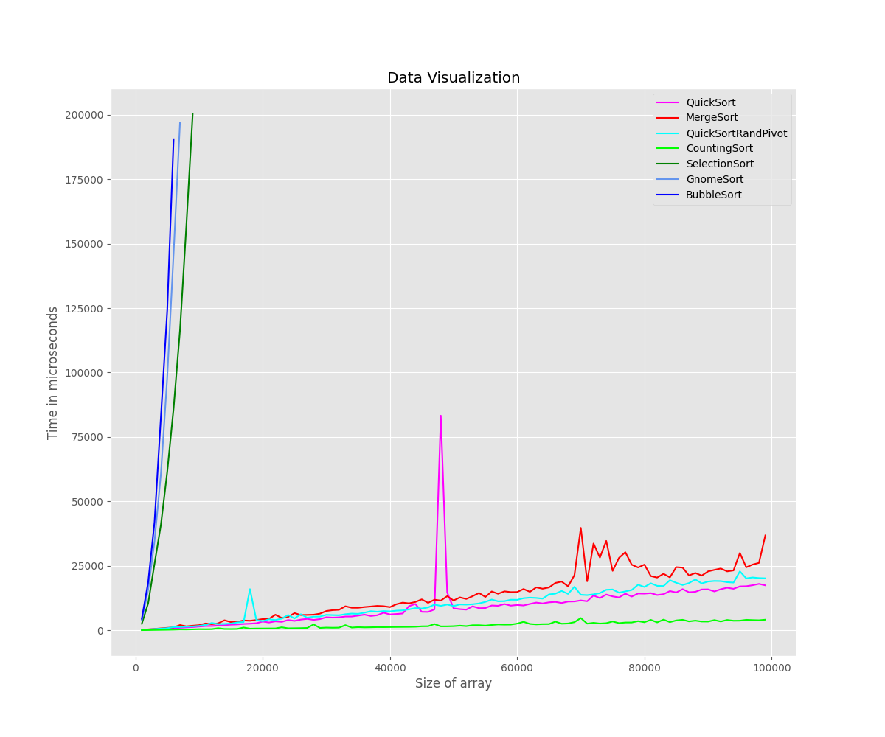

## Сортировка слиянием (Merge Sort)

Сортировка слиянием (Merge Sort) — это эффективный алгоритм сортировки, который основан на принципе "разделяй и властвуй". Он работает путем рекурсивного разбиения массива на две половины, сортировки каждой половины отдельно, а затем слияния обеих отсортированных половин в один отсортированный массив.

### Принцип работы

Основная идея сортировки слиянием состоит в следующем:

1. Если длина массива больше 1, то массив делится пополам на две равные части.
2. Рекурсивно вызывается сортировка слиянием для каждой половины массива.
3. Две отсортированные половины объединяются (сливаются) в один отсортированный массив.

### Временная сложность

Временная сложность сортировки слиянием составляет O(n log n) в худшем, среднем и лучшем случаях, где n - длина входного массива. Это происходит из-за того, что на каждом уровне рекурсии массив делится пополам, что требует log n шагов, а объединение двух отсортированных половин может быть выполнено за линейное время O(n).
Чтобы оценить время работы этого алгоритма, составим рекуррентное соотношение. Пускай T(n) — время сортировки массива длины n , тогда для сортировки слиянием справедливо T(n)=2T(n/2)+O(n)

O(n) — время, необходимое на то, чтобы слить два массива длины n . Распишем это соотношение:

T(n)=2T(n/2)+O(n)=4T(n/4)+2O(n)=⋯=T(1)+log(n)O(n)=O(nlog(n))
### Шаги алгоритма более подробно:

1. Рекурсивное разбиение: Задача разбивается на меньшие подзадачи до тех пор, пока размер массива не станет равным 1 (массив длины 1 считается упорядоченным).

2. Соединение двух упорядоченных массивов в один: На каждом шаге берется меньший из двух первых элементов подмассивов и записывается в результирующий массив. При этом счетчики номеров элементов результирующего массива и подмассива, из которого был взят элемент, увеличиваются на 1.

3. "Прицепление" остатка: Когда один из подмассивов заканчивается, все оставшиеся элементы второго подмассива добавляются в результирующий массив.

Этот алгоритм эффективен и устойчив к различным типам входных данных, что делает его популярным методом сортировки.

## Быстрая сортировка (Quicksort)

Быстрая сортировка (Quicksort) — один из наиболее популярных и эффективных алгоритмов сортировки, основанный на принципе "разделяй и властвуй". Алгоритм был разработан Тони Хоаром в 1959 году.

### Принцип работы

Основная идея быстрой сортировки заключается в следующем:

1. Выбирается опорный элемент (pivot) из массива.
2. Все элементы массива перераспределяются таким образом, чтобы меньшие элементы располагались перед опорным элементом, а большие или равные — после него.
3. Рекурсивно применяется быстрая сортировка для подмассивов, расположенных до и после опорного элемента.

### Временная сложность

Временная сложность быстрой сортировки зависит от выбора опорного элемента:

- Лучший случай: если опорный элемент всегда оказывается в середине массива, то сложность алгоритма будет O(n log n).
- Худший случай: если опорный элемент всегда оказывается самым большим или самым маленьким элементом в массиве, то сложность алгоритма будет O(n^2).
- Средний случай: при случайном выборе опорного элемента, средняя временная сложность также будет O(n log n).
Временная сложность алгоритма выражается через нее же по формуле: T(n) = n + T(a * n) + T((1 — a) * n). Таким образом, когда мы вызываем сортировку массива из n элементов, тратится порядка n операций на выполнение partition'а и на выполнения себя же 2 раза с параметрами a * n и (1 — a) * n, потому что пивот разделил элемент на доли.

В лучшем случае a = 1 / 2, то есть пивот каждый раз делит участок на две равные части. В таком случае: T(n) = n + 2 * T(n / 2) = n + 2 * (n / 2 + 2 * T(n / 4)) = n + n + 4 * T(n / 4) = n + n + 4 * (n / 4 + 2 * T(n / 8)) = n + n + n + 8 * T(n / 8) =…. Итого будет log(n) слагаемых, потому как слагаемые появляются до тех пор, пока аргумент не уменьшится до 1. В результате T(n) = O(n * log(n)).

### Преимущества и недостатки

Преимущества:

- Высокая эффективность для больших наборов данных (O(n log n) в среднем случае).
- Быстрая сортировка работает на месте (in-place), не требуя дополнительной памяти.
- Хорошо подходит для распараллеливания.

Недостатки:

- Неэффективна для небольших наборов данных.
- Худшая сложность O(n^2) для частично отсортированных массивов.
- Существует небольшой дополнительный накладной расход из-за рекурсии.
 ## Сортировка подсчетом (Counting Sort)

Сортировка подсчетом (Counting Sort) — это эффективный алгоритм сортировки, который работает на основе подсчета количества вхождений каждого уникального элемента в массиве. Этот алгоритм подходит только для массивов с небольшим диапазоном значений, таких как массивы из целых чисел со значениями от 0 до k.

### Принцип работы

Основная идея сортировки подсчетом состоит в следующем:

1. Находим диапазон значений элементов в массиве (минимальное и максимальное значения).
2. Создаем дополнительный массив (счетчик) размера max - min + 1, где каждый элемент изначально равен нулю.
3. Проходим по исходному массиву и для каждого элемента увеличиваем соответствующий счетчик в массиве-счетчике на 1.
4. Изменяем массив-счетчик таким образом, чтобы каждый элемент содержал сумму этого элемента и всех предыдущих элементов.
5. Создаем новый выходной массив для хранения отсортированных элементов.
6. Проходим по исходному массиву в обратном порядке. Берем элемент из исходного массива, уменьшаем соответствующий счетчик в массиве-счетчике на 1 и помещаем элемент в выходной массив на позицию, равную значению счетчика.

### Временная сложность

Временная сложность сортировки подсчетом составляет O(n + k), где n - длина входного массива, а k - диапазон значений элементов. Если диапазон значений намного меньше размера массива (k << n), то сортировка будет очень эффективной.

### Преимущества и недостатки

Преимущества:

- Высокая эффективность для массивов с небольшим диапазоном значений.
- Стабильная сортировка (сохраняется относительный порядок равных элементов).

Недостатки:

- Требуется дополнительная память для хранения массива-счетчика.
- Неэффективна для массивов с большим диапазоном значений.
## Сортировка пузырьком (Bubble Sort)

Сортировка пузырьком (Bubble Sort) — один из самых простых алгоритмов сортировки. Он работает путем последовательного сравнения соседних элементов и их перестановки в нужном порядке.

### Принцип работы

Основная идея сортировки пузырьком состоит в следующем:

1. Сравниваются первый и второй элементы массива. Если первый элемент больше второго, они меняются местами.
2. Затем сравниваются второй и третий элементы, и при необходимости они также меняются местами.
3. Этот процесс повторяется для всех соседних пар элементов в массиве.
4. После первого прохода по массиву самый большой элемент оказывается на своем месте в конце массива.
5. Алгоритм повторяется для оставшейся части массива (n-1 элемент), пока весь массив не будет отсортирован.

### Временная сложность

Временная сложность сортировки пузырьком в худшем случае составляет O(n^2), где n - длина входного массива. Это происходит, когда массив отсортирован в обратном порядке, и алгоритму приходится выполнять максимальное количество проходов и перестановок.

В лучшем случае, когда массив уже отсортирован, временная сложность будет O(n), так как алгоритм выполнит только один проход без перестановок.

### Преимущества и недостатки

Преимущества:

- Простота реализации.
- Не требуется дополнительной памяти.
- Стабильная сортировка (сохраняется относительный порядок равных элементов).

Недостатки:

- Низкая эффективность для больших наборов данных.

## Сортировка выбором (Selection Sort)

Сортировка выбором (Selection Sort) — это простой алгоритм сортировки, который работает путем нахождения минимального (или максимального) элемента в неотсортированной части массива и его перемещения на соответствующее место в отсортированной части массива.

### Принцип работы

Основная идея сортировки выбором состоит в следующем:

1. Находится минимальный элемент в неотсортированной части массива.
2. Этот минимальный элемент меняется местами с первым элементом неотсортированной части массива.
3. Теперь первый элемент находится на своем месте, и процесс повторяется для оставшейся неотсортированной части массива.
4. Этот процесс продолжается, пока весь массив не будет отсортирован.

### Временная сложность

Временная сложность сортировки выбором в худшем, среднем и лучшем случаях составляет O(n^2), где n - длина входного массива. Это происходит из-за того, что алгоритму необходимо выполнить n-1 проход по массиву, и на каждом проходе найти минимальный элемент в неотсортированной части массива.

### Преимущества и недостатки

Преимущества:

- Простота реализации.
- Не требуется дополнительной памяти.
- Эффективна для небольших наборов данных.

Недостатки:

- Низкая эффективность для больших наборов данных.
- Не стабильная сортировка (не сохраняется относительный порядок равных элементов).
## Гномья сортировка (Gnome Sort)

Гномья сортировка является одним из необычных алгоритмов сортировки, который имитирует движение гнома, перемещающегося в саду. Этот алгоритм работает следующим образом:

1. Начинаем с индекса 0 и сравниваем текущий элемент arr[index] с предыдущим arr[index - 1].
2. Если элемент на своем месте (т.е. arr[index] >= arr[index - 1]), мы перемещаемся к следующему элементу, увеличивая index на 1.
3. Если элемент не на своем месте (т.е. arr[index] < arr[index - 1]), мы меняем местами текущий элемент с предыдущим arr[index], arr[index - 1] = arr[index - 1], arr[index] и перемещаем гнома назад, уменьшая index на 1.
4. Процесс повторяется до тех пор, пока не будет отсортирован весь массив.

Таким образом, гномья сортировка можно представить как своего рода сортировку вставками, где элементы перемещаются вперед и назад, пока они не будут отсортированы.

### Временная сложность

Гномья сортировка имеет сложность O(n^2) в худшем случае, что делает ее не самым эффективным алгоритмом для больших наборов данных. Однако она может быть полезна для небольших массивов или частично отсортированных данных.

### Преимущества и недостатки

Преимущества:

- Простота реализации
- Хорошая производительность для частично отсортированных данных
- Не требуется дополнительной памяти

Недостатки:

- Низкая эффективность для больших наборов данных
- Сложность O(n^2) в худшем случае

